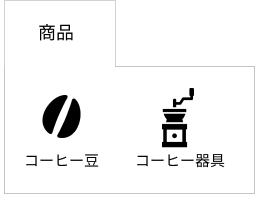
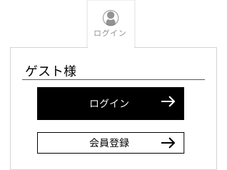
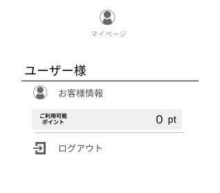

### 画面詳細図
## ヘッダー
### プロトタイプは以下のリンク先
[プロトタイプ](https://www.figma.com/file/Oa2XrfbS2Hee9dSI9acZXo/coffee?node-id=0%3A1)
---

---
補足：このヘッダーは全ページに配置する

補足:対応DBの列はDB設計後、○を対応するテーブル・カラム名に差し替えること。

| ID | 検索 | 内容 | アクション | イベント | 対応DB |
|----|-----|-----|---------|--------|-------|
