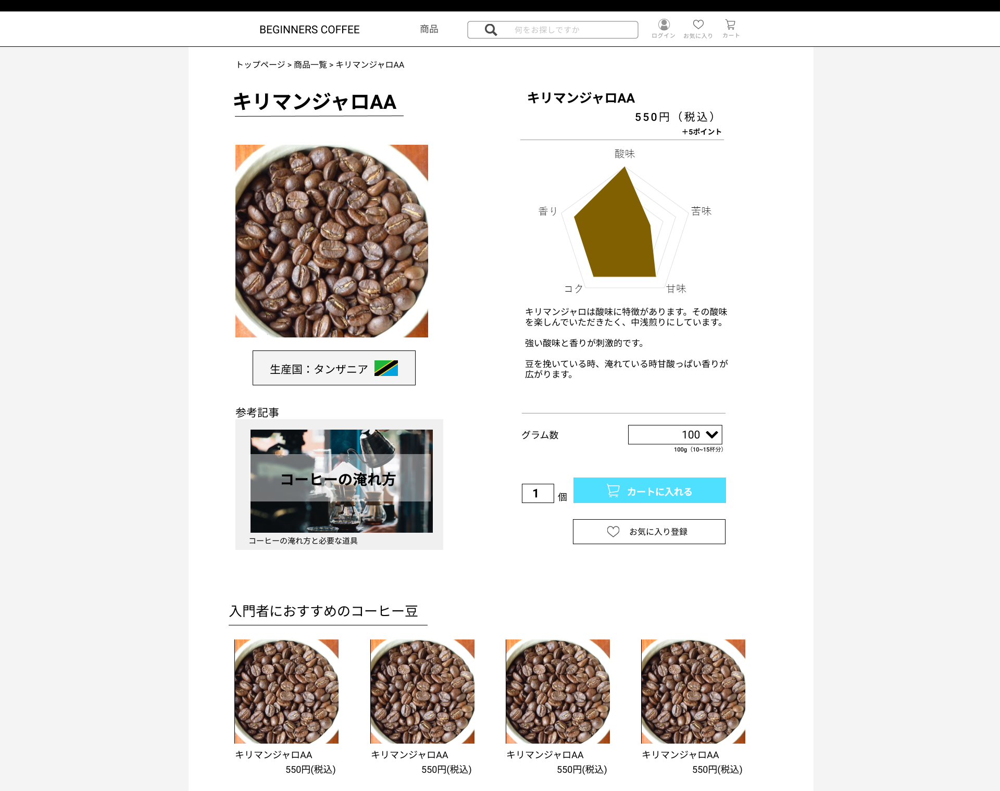

### 画面詳細図
## 商品詳細ページ
### プロトタイプは以下のリンク先
[プロトタイプ](https://www.figma.com/file/Oa2XrfbS2Hee9dSI9acZXo/coffee?node-id=0%3A1)
---
 
---

補足:対応DBの列はDB設計後、○を対応するテーブル・カラム名に差し替えること。

| ID | 検索 | 内容 | アクション | イベント | 対応DB |
|----|-----|-----|---------|--------|-------|
|1|パンくずリスト|パンくずリスト|クリック|クリックしたページに遷移|-|
|2|商品名(見出し)|テキスト表示|-|-|〇|
|3|商品画像|画像表示|クリック|拡大表示|〇|
|4|商品名|テキスト表示|-|-|〇|
|5|商品金額|テキスト表示|-|-|〇|
|6|レーダーチャート|画像表示|-|-|〇|
|7|商品説明|テキスト表示|-|-|〇|
|8|グラム数|テキスト表示|-|-|-|
|9|グラム数セレクトボックス|セレクトボックス|選択|-|〇|
|10|100g(10~15杯分)|テキスト表示|-|-|-|
|11|個数テキストボックス|テキストボックス|入力|-|〇|
|12|カートに入れるボタン|ボタン|クリック|カートに商品を追加する処理|〇|
|13|お気に入り登録ボタン|ボタン|クリック|お気に入りに商品を追加する処理|〇|
|14|生産国表示|テキストボタン|クリック|表示されている生産国でサイト内検索|〇|
|15|参考記事|画像リンク|クリック|表示されているページに遷移|〇|
|16|おすすめ|テキスト表示|-|-|-|
|17|商品画像表示|画像リンク|クリック|商品詳細へ遷移|〇|
|18|商品名|テキストリンク|クリック|商品詳細へ遷移|〇|
|19|商品価格|テキストリンク|クリック|商品詳細へ遷移|〇|
