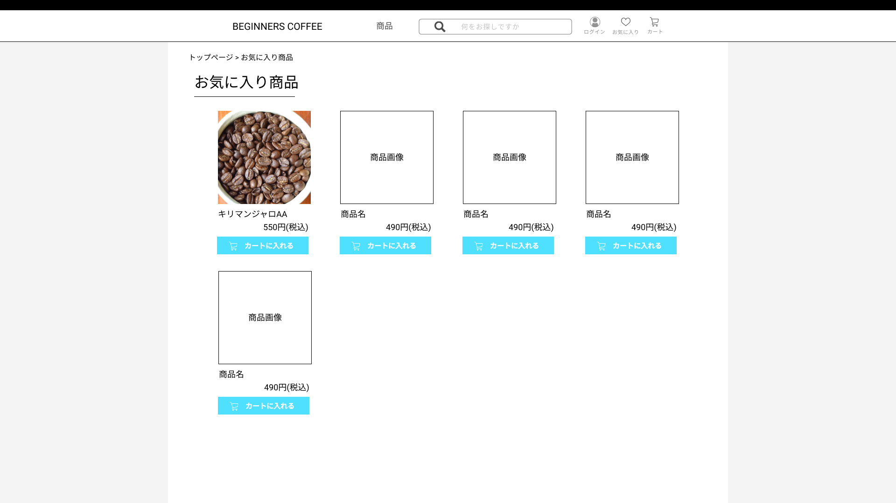

### 画面詳細図
## お気に入りページ
### プロトタイプは以下のリンク先
[プロトタイプ](https://www.figma.com/file/Oa2XrfbS2Hee9dSI9acZXo/coffee?node-id=0%3A1)
---

---

補足:対応DBの列はDB設計後、○を対応するテーブル・カラム名に差し替えること。

| ID | 検索 | 内容 | アクション | イベント | 対応DB |
|----|-----|-----|---------|--------|-------|
|1|パンくずリスト|テキストリンク|クリック|トップページへ遷移|-|
|2|お気に入り商品|テキスト表示|-|-|-|
|3|商品画像|画像表示|クリック|商品詳細ページに遷移|○|
|4|商品名|テキスト表示|-|-|-|
|5|金額|テキスト表示|-|-|-|
