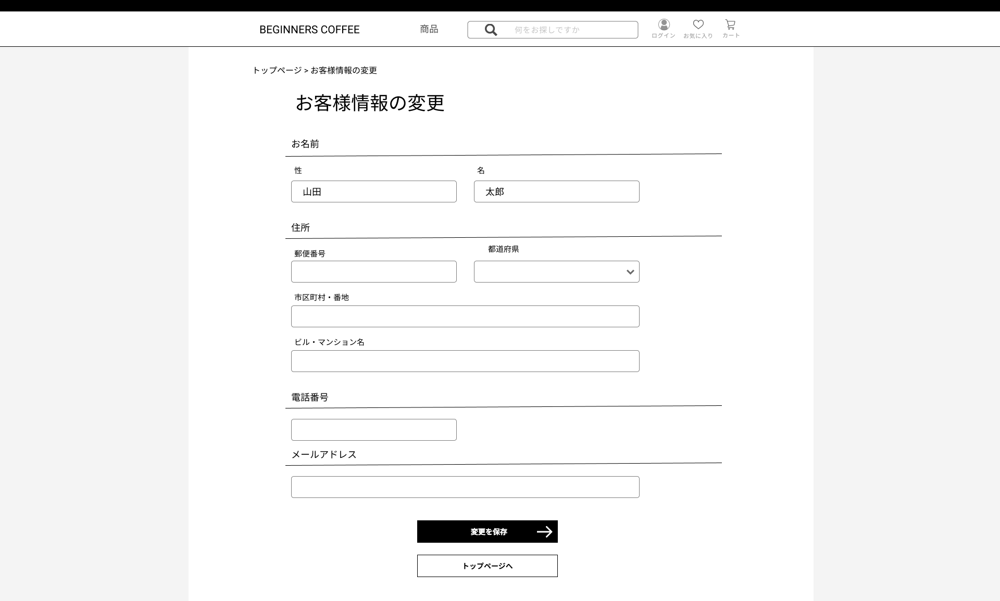

### 画面詳細図
## 会員情報変更ページ
### プロトタイプは以下のリンク先
[プロトタイプ](https://www.figma.com/file/Oa2XrfbS2Hee9dSI9acZXo/coffee?node-id=0%3A1)
---

---

補足:対応DBの列はDB設計後、○を対応するテーブル・カラム名に差し替えること。

| ID | 検索 | 内容 | アクション | イベント | 対応DB |
|----|-----|-----|---------|--------|-------|
|1|お客様情報の変更|テキスト表示|-|-|-|
|2|お名前|テキスト表示|-|-|-|
|3|性|テキスト表示|-|-|-|
|4|名|テキスト表示|-|-|-|
|5|性テキストボックス|入力|-|-|○|
|6|名テキストボックス|入力|-|-|○|
|7|住所|テキスト表示|-|-|-|
|8|郵便番号|テキスト表示|-|-|-|
|9|郵便番号テキストボックス|入力|-|-|○|
|10|都道府県|テキスト表示|-|-|-|
|11|都道府県セレクトボックス|選択|-|-|○|
|12|市区町村・番地|テキスト表示|-|-|-|
|13|市区町村・番地テキストボックス|入力|-|-|○|
|14|ビル・マンション名|テキスト表示|-|-|-|
|15|ビル・マンション名テキストボックス|入力|-|-|○|
|16|電話番号|テキスト表示|-|-|-|
|17|電話番号テキストボックス|入力|-|-|○|
|18|メールアドレス|テキスト表示|-|-|-|
|19|メールアドレステキストボックス|入力|-|-|○|
|20|変更を保存ボタン|ボタン|クリック|会員情報が変更され、トップページに遷移|○|
|21|トップページボタン|ボタン|クリック|トップページに遷移|○|
