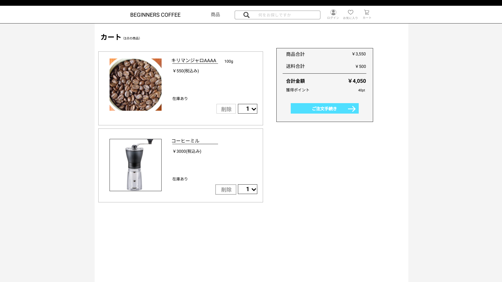

### 画面詳細図
## ショッピングカート
### プロトタイプは以下のリンク先
[プロトタイプ](https://www.figma.com/file/Oa2XrfbS2Hee9dSI9acZXo/coffee?node-id=0%3A1)
---

---

補足:対応DBの列はDB設計後、○を対応するテーブル・カラム名に差し替えること。

| ID | 検索 | 内容 | アクション | イベント | 対応DB |
|----|-----|-----|---------|--------|-------|
|1|カート|テキスト表示|-|-|-|
|2|画像|画像|-|-|-|
|3|キリマンジャロAAAA|テキスト表示|-|-|-|
|4|¥550(税込み)|テキスト表示|-|-|-|
|5|在庫あり|テキスト表示|-|-|-|
|6|削除|ボタン|クリック|ショッピングカートから商品を削除する|〇|
|7|個数セレクトボックス|セレクトボックス|選択|-|-|
|8|商品合計|||||
|9||||||
|10|送料合計||||
|11|||||
|12|合計金額||||
|13|||||
|14|獲得ポイント||||
|15|||||
|16|注文手続きボタン|ボタン|注文手続きページに移||
