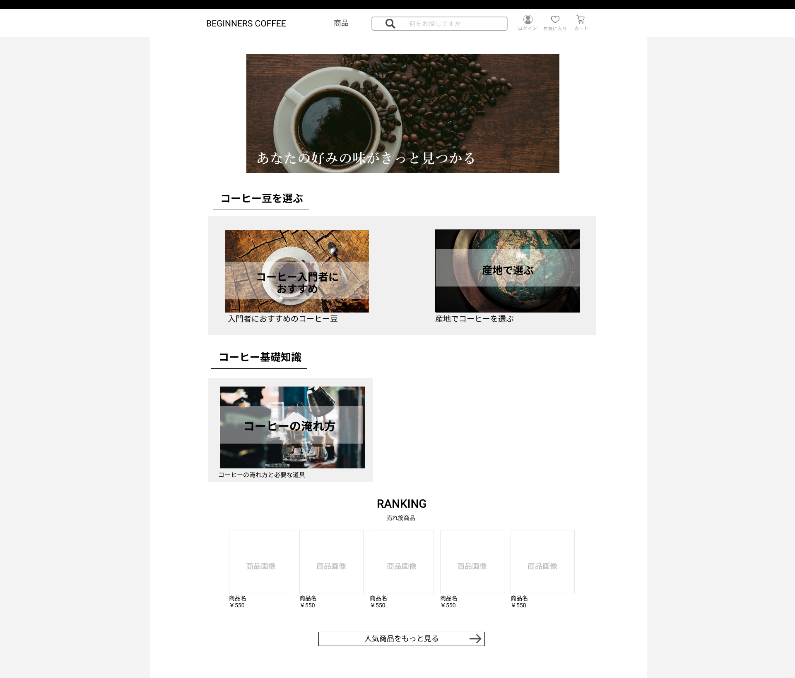

### 画面詳細図
## トップページ
### プロトタイプは以下のリンク先
[プロトタイプ](https://www.figma.com/file/Oa2XrfbS2Hee9dSI9acZXo/coffee?node-id=0%3A1)
---

---

補足:対応DBの列はDB設計後、○を対応するテーブル・カラム名に差し替えること。

| ID | 検索 | 内容 | アクション | イベント | 対応DB |
|----|-----|-----|---------|--------|-------|
||ECサイト紹介画像|画像表示|-|-|-|
||コーヒーを選ぶ|見出し表示|-|-|-|
||おすすめコーヒーリンク|画像リンク|クリック|商品一覧へ遷移(表示商品指定)|〇|
||産地でコーヒーを選ぶリンク|画像リンク|クリック|産地で選ぶページへ遷移|-|
||コーヒー基礎知識|見出し表示|-|-|-|
||コーヒーの入れ方リンク|画像リンク|クリック|コーヒーの淹れ方に遷移|-|
||RANKING|見出し表示|-|-|-|
||売れ筋商品|テキスト表示|-|-|-|
||商品画像|画像リンク|クリック|商品詳細へ遷移|〇|
||商品名|テキストリンク|クリック|商品詳細へ遷移|〇|
||商品金額|テキストリンク|クリック|商品詳細へ遷移|〇|
||もっと見るボタン|ボタン|クリック|商品一覧へ遷移|〇|
