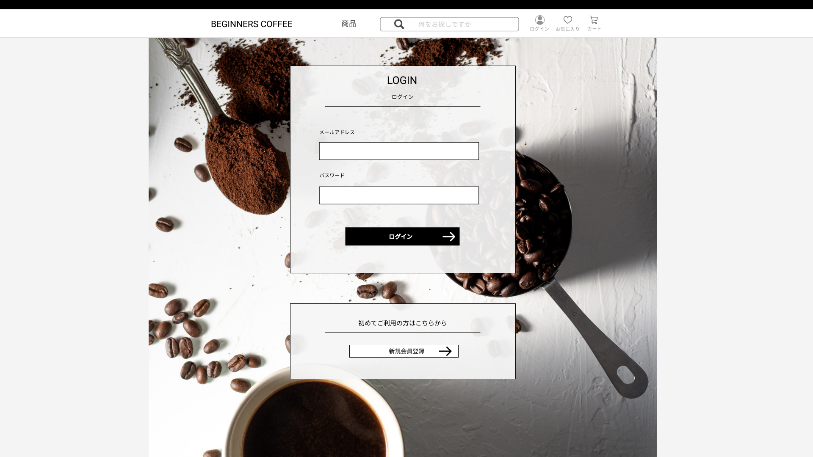

### 画面詳細図
## ログインページ
### プロトタイプは以下のリンク先
[プロトタイプ](https://www.figma.com/file/Oa2XrfbS2Hee9dSI9acZXo/coffee?node-id=0%3A1)
---

---

補足:対応DBの列はDB設計後、○を対応するテーブル・カラム名に差し替えること。

| ID | 検索 | 内容 | アクション | イベント | 対応DB |
|---|---|---|---|---|---|
|1|LOGIN|テキスト表示|-|-|-|
|2|ログイン|テキスト表示|-|-|-|
|3|メールアドレス|テキスト表示|-|-|-|
|4|メールアドレステキストボックス|テキストボックス|入力|-|〇|
|5|パスワード|テキスト表示|-|-|-|
|6|パスワードテキストボックス|テキストボックス|入力|-|〇|
|7|ログインボタン|ボタン|クリック|ログインしてトップページに戻る|-|
|8|新規登録ボタン|ボタン|クリック|新規登録ページに遷移|-|
