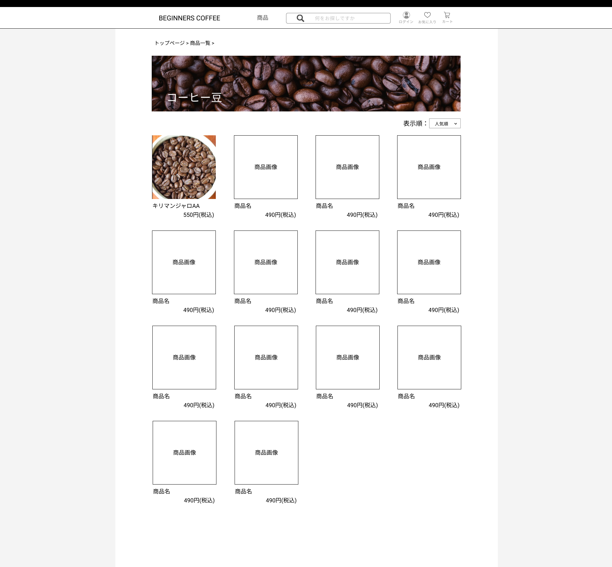
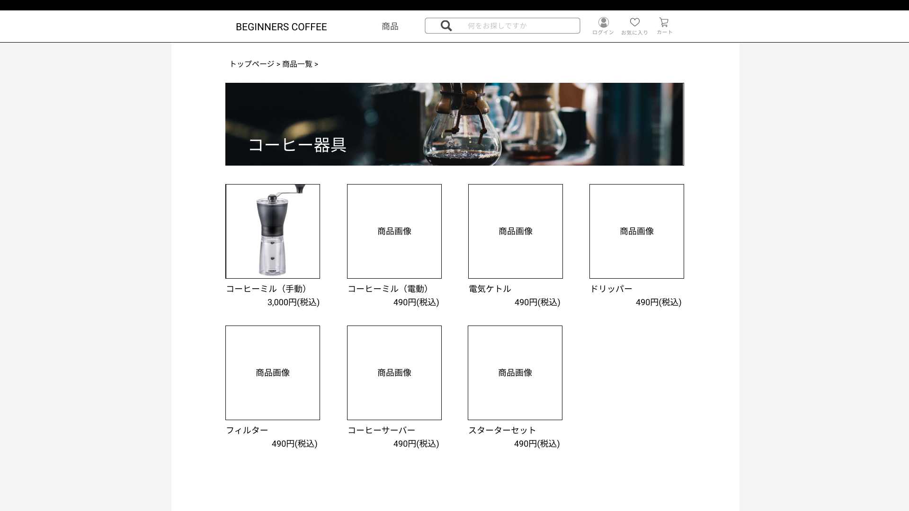

### 画面詳細図
## 商品一覧
### プロトタイプは以下のリンク先
[プロトタイプ](https://www.figma.com/file/Oa2XrfbS2Hee9dSI9acZXo/coffee?node-id=0%3A1)
---
商品一覧(コーヒー豆) 
 
商品一覧(器具) 
 
---

補足:対応DBの列はDB設計後、○を対応するテーブル・カラム名に差し替えること。

## 商品一覧
| ID | 検索 | 内容 | アクション | イベント | 対応DB |
|----|-----|-----|---------|--------|-------|
|1|パンくずリスト|テキストリンク|クリック|クリックしたページに遷移|〇|
|2|ページ見出し画像|画像表示|-|-|-|
|3|コーヒー豆|テキスト表示|-|-|-|
|4|表示順|テキスト表示|-|-|-|
|5|並び替えセレクトボックス|セレクトボックス|選択|選択順に再表示|-|〇|
|6|商品画像|画像表示|クリック|商品詳細へ遷移|〇|
|7|商品名|テキスト表示|クリック|商品詳細へ遷移|〇|
|8|商品金額|テキスト表示|クリック|商品詳細へ遷移|〇|
