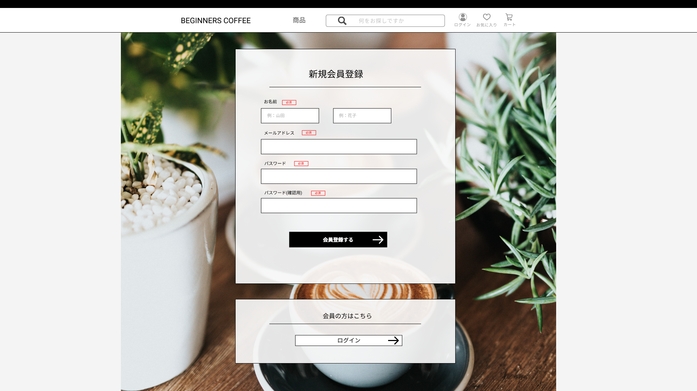

### 画面詳細図
## 新規会員登録ページ
### プロトタイプは以下のリンク先
[プロトタイプ](https://www.figma.com/file/Oa2XrfbS2Hee9dSI9acZXo/coffee?node-id=0%3A1)
---

---

補足:対応DBの列はDB設計後、○を対応するテーブル・カラム名に差し替えること。

| ID | 検索 | 内容 | アクション | イベント | 対応DB |
|----|-----|-----|---------|--------|-------|
|1|新規会員登録|テキスト表示|-|-|-|
|2|お名前|テキスト表示|-|-|-|
|3|必須項目マーク|テキスト表示|-|-|-|
|4|お名前(性)テキストボックス|テキストボックス|入力|-|〇|
|5|お名前(名)テキストボックス|テキストボックス|入力|-|〇|
|6|メールアドレス|テキスト表示|-|-|-|
|7|必須項目マーク|テキスト表示|-|-|-|
|8|メールアドレステキストボックス|テキストボックス|入力|-|〇|
|9|パスワード|テキスト表示|-|-|-|
|10|必須項目マーク|テキスト表示|-|-|-|
|11|パスワードテキストボックス|テキストボックス|入力|-|〇|
|12|会員登録するボタン|ボタン|クリック|会員登録し、トップページに遷移|〇|
|13|会員の方はこちら|テキスト表示|-|-|-|
|14|ログインへボタン|ボタン|クリック|ログイン画面へ遷移|-|
