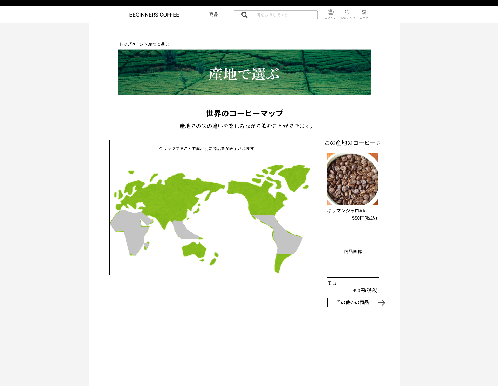

### 画面詳細図
## 産地で選ぶページ
### プロトタイプは以下のリンク先
[プロトタイプ](https://www.figma.com/file/Oa2XrfbS2Hee9dSI9acZXo/coffee?node-id=0%3A1)
---

---

補足:対応DBの列はDB設計後、○を対応するテーブル・カラム名に差し替えること。

| ID | 検索 | 内容 | アクション | イベント | 対応DB |
|----|-----|-----|---------|--------|-------|
||パンくずリスト|テキストリンク|クリック|クリックしたページへ遷移|-|
||ページ画像|画像表示|-|-|-|
||ページ見出し|見出し表示|-|-|-|
||ページ説明|テキスト表示|-|-|-|
||世界地図画像|画像表示|クリック|クリックした位置の産地の説明、コーヒー豆を表示|〇|
||この産地のコーヒー豆|見出し|-|-|-|
||商品画像|画像リンク|クリック|商品詳細へ遷移|〇|
||商品名|テキストリンク|クリック|商品詳細へ遷移|〇|
||商品金額|テキストリンク|クリック|商品詳細へ遷移|〇|
||その他の商品|ボタン|クリック|商品一覧へ遷移|〇|

