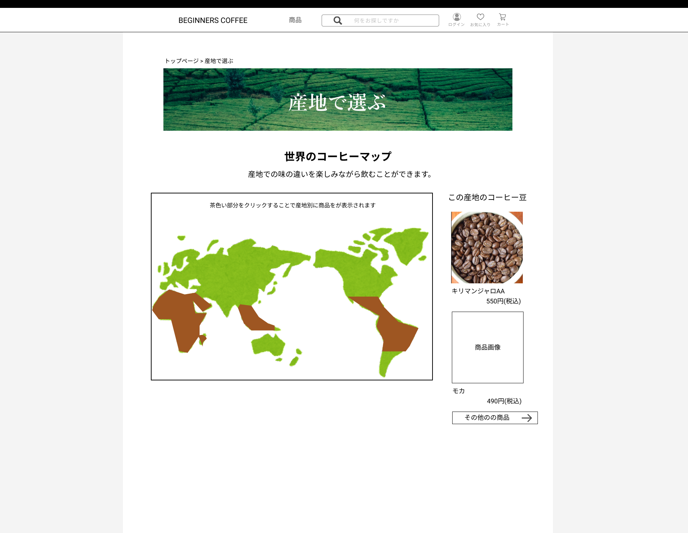
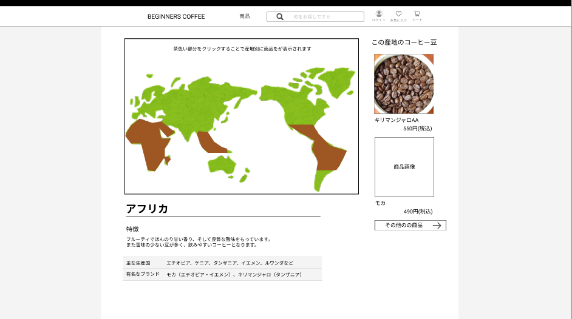

### 画面詳細図
## 産地で選ぶページ
### プロトタイプは以下のリンク先
[プロトタイプ](https://www.figma.com/file/Oa2XrfbS2Hee9dSI9acZXo/coffee?node-id=0%3A1)
---

---

補足:対応DBの列はDB設計後、○を対応するテーブル・カラム名に差し替えること。

| ID | 検索 | 内容 | アクション | イベント | 対応DB |
|----|-----|-----|---------|--------|-------|
|1|パンくずリスト|テキストリンク|クリック|クリックしたページへ遷移|-|
|2|ページ画像|画像表示|-|-|-|
|3|ページ見出し|見出し表示|-|-|-|
|4|ページ説明|テキスト表示|-|-|-|
|5|世界地図画像|画像表示|クリック|クリックした位置の産地の説明、コーヒー豆を表示|〇|
|6|この産地のコーヒー豆|見出し|-|-|-|
|7|商品画像|画像リンク|クリック|商品詳細へ遷移|〇|
|8|商品名|テキストリンク|クリック|商品詳細へ遷移|〇|
|9|商品金額|テキストリンク|クリック|商品詳細へ遷移|〇|
|10|その他の商品|ボタン|クリック|商品一覧へ遷移|〇|
|11|産地名|テキスト表示|-|-|-|
|12|特徴|テキスト表示|-|-|-|
|13|主な生産国|テキスト表示|-|-|-|
